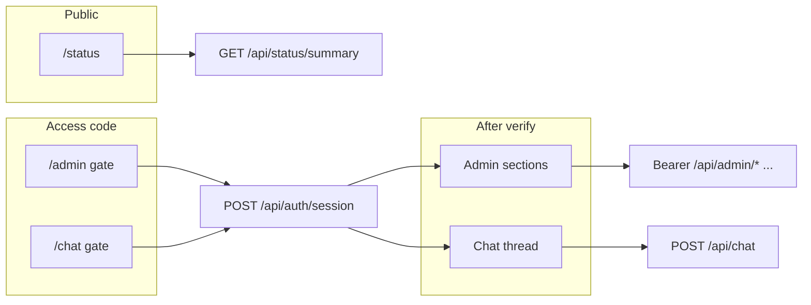

# Home AI Platform UI and API plan

## Current backend snapshot (relevant)

- Global prefix **`/api`** ([`apps/server/src/main.ts`](../../apps/server/src/main.ts)); CORS already allows browser origins.
- **Chat**: [`POST /api/chat`](../../apps/server/src/orchestrator/chat/chat.controller.ts) accepts `{ message, user_id }`. The orchestrator resolves the user via [`UsersService.reader().getByUserIdOrMessagingId`](../../apps/server/src/orchestrator/ai-orchestrator.service.ts) and **does not** verify an access code today.
- **Admin-ish JSON today** (no auth): users [`/api/admin/users`](../../apps/server/src/core/entities/user/user.controller.ts), tasks [`/api/admin/tasks`](../../apps/server/src/core/entities/task/tasks.controller.ts), task-requests [`/api/admin/task-requests`](../../apps/server/src/core/entities/task-request/task-requests.controller.ts), health [`/api/admin/health`](../../apps/server/src/health/health.controller.ts).
- **Access codes**: [`UsersService.verifyAccessCode`](../../apps/server/src/core/entities/user/user.service.ts) and hashing on create/update already exist; [`User`](../../apps/server/src/core/entities/user/user.domain.ts) includes `accessCodeHash` (responses must **strip** this field for any client-facing DTO).
- **Gaps**: No HTTP surface for **devices**, **facts**, or **DB app_config** rows. Controllers [`NotificationsController`](../../apps/server/src/core/entities/notification/notifications.controller.ts) and [`AuditController`](../../apps/server/src/core/entities/monitoring/audit/audit.controller.ts) are **not** listed in [`CoreModule`](../../apps/server/src/core/core.module.ts) `controllers` (endpoints are effectively dead until registered). `GET /api/admin/task-requests/pending` references `findPendingApprovals` **without** invoking it ([`task-requests.controller.ts`](../../apps/server/src/core/entities/task-request/task-requests.controller.ts)) — should be `findPendingApprovals()` (store method exists on [`TaskRequestStore`](../../apps/server/src/core/entities/task-request/task-request.store.ts)).

## Constraints you specified

- **Do not** edit [`*.domain.ts`](../../apps/server/src/core/entities/user/user.domain.ts) (or equivalent domain interfaces) or **move/reorganize** files under `apps/server` (new files stay alongside existing modules, e.g. new controller next to related entity).
- **Do** add endpoints, guards, and **store/service methods** where needed (adding methods on existing stores/services is fine as long as domain interfaces stay untouched).

---

## High-level UI architecture

Introduce a dedicated frontend at **`apps/web`** (Vite + React + TypeScript), with:

- **React Router** for three top-level areas: `/status` (public), `/chat` (access gate + chat), `/admin` (access gate + CRUD sections).
- **TanStack Query** for server state; **Zustand** or React context for session token + minimal user profile cache.
- **Tailwind CSS** + **shadcn/ui** (Radix primitives) for a dense, modern admin shell: sidebar navigation, data tables with loading/empty/error states, dialogs/forms for create/edit, and a chat layout modeled on common assistant UIs (message list, composer, optional “thinking” / status line from orchestrator `status`).
- **Dark mode (required)**: Tailwind `darkMode: 'class'`, root theme provider (e.g. **`next-themes`** even without Next.js, or a tiny context + `localStorage` persistence), and a **system / light / dark** toggle in the shell so admin and chat stay consistent. shadcn tokens map cleanly to dark variables.

**Environment**: `VITE_API_BASE_URL` defaulting to `http://localhost:3000/api` in dev; Vite **proxy** optional to avoid CORS friction during local dev.

---

## Basic UI flow (user journeys)

1. **Status**: User opens `/status` → periodic refresh of a **read-only** dashboard (no access code): health, uptime, and a **curated** set of facts/metrics (see API below). No sensitive user/device secrets.
2. **Chat**: User opens `/chat` → enters **account name** (display `name`, case-insensitive) + **access code** → `POST /api/auth/session` → on success, store **session token** + show chat → each message `POST /api/chat` with `Authorization: Bearer …` (and message body). Clear error states for unknown user / bad code / inactive user.
3. **Admin**: User opens `/admin` → same gate (name + access code) → require **`role === 'admin'`** (or a small capability map derived from role) for mutating routes; non-admins get a clear “insufficient permissions” UX if you still allow them to obtain a token for future use cases.

---

## Backend: access-code session (new)

**Goal**: Verify access code once, then use a signed **JWT** (or similar) for subsequent requests so the UI stays smooth and the raw code is not re-sent on every chat turn.

| Endpoint | Purpose |
|----------|---------|
| `POST /api/auth/session` | Body: `{ name: string, accessCode: string }`. Resolve user by **display name** (case-insensitive); verify `verifyAccessCode`, ensure `active`. Return **public user DTO** (no hash) + **JWT** (claims: `sub`, `role`, `iat`, `exp`). |
| `POST /api/auth/logout` | Optional no-op or client-side only; include only if you add server-side denylist later. |

**NestJS pieces** (new files colocated under a small folder you add without moving existing code, e.g. `apps/server/src/auth/`):

- **`AuthService`**: wraps `UsersService` verification + JWT signing.
- **`JwtAuthGuard` + `@Public()` decorator**: default guard on new “UI” controllers; skip for `/api/status/*` and `/api/auth/session`.
- **`CurrentUser()` decorator**: reads validated payload for `sub` / `role`.

Use **`@nestjs/jwt`** with secret + TTL from existing env access pattern ([`AppConfigService.getFromEnv`](../../apps/server/src/core/entities/app-config/app-config.service.ts) or `ConfigService`).

---

## Backend: protect and extend admin HTTP API

Apply **`JwtAuthGuard`** to existing admin controllers (users, tasks, task-requests) and any new admin controllers, plus **role checks** (`admin` for destructive / user management; optionally read-only for others later).

**New admin endpoints** (all under existing `/api/admin/...` prefix for consistency):

| Area | Methods | Notes |
|------|---------|--------|
| **Devices (Home AI)** | `GET/POST /api/admin/devices`, `GET/PATCH/DELETE /api/admin/devices/:id`, optional `PATCH .../active` | **System of record** for the platform: [`DeviceService`](../../apps/server/src/core/entities/device/device.service.ts) / [`DeviceStore`](../../apps/server/src/core/entities/device/device.store.ts) persist rows in the **`devices`** table (slug, friendly name, **`haEntityId`**, roles, metadata, etc.). Rest of Home AI reads devices from here—not directly from HA on every request. |
| **Home Assistant (integration)** | `GET /api/admin/home-assistant/entities` (optional `?q=` search); optional `GET .../entities/:entityId` for detail/state | **Integration / catalog only.** [`HomeAssistantService`](../../apps/server/src/remote/home-assistant/home-assistant.service.ts) talks to HA (WebSocket + in-memory entity map) via **`getAllEntities()`**, **`findEntityByName(q)`**, **`getState(entityId)`**. It does **not** replace `DeviceStore`; it **supplies candidates** so an admin can **import** a device into the Home AI DB. Implement controller in **[`RemoteModule`](../../apps/server/src/remote/remote.module.ts)** to avoid **`CoreModule` ↔ `RemoteModule`** circular imports (`RemoteModule` already imports `CoreModule`). |
| **Facts** | `GET/POST /api/admin/facts`, `GET/PATCH/DELETE /api/admin/facts/:id` | Delegate to [`FactService`](../../apps/server/src/core/fact/fact.service.ts) / [`FactStore`](../../apps/server/src/core/fact/fact.store.ts). |
| **App config (DB)** | **`POST /api/admin/app-config/search`**, `GET/PATCH /api/admin/app-config/:key`, `PATCH .../active` | List via **`AppConfigStore.search`** / **`AppConfigService.search`** (body: optional `includeInactive`, **`search`**, `page` / `pageSize`). Wire writes to existing [`AppConfigService.setConfig` / `toggleConfig`](../../apps/server/src/core/entities/app-config/app-config.service.ts). |
| **Users** (existing) | Keep routes; add **DTO mapping** in controller or thin **`UserResponseMapper`** helper file to **omit `accessCodeHash`** on all responses. |
| **Tasks / task-requests** (existing) | Keep; fix pending route; add auth guard. |

**Device flow (conceptual):** Home Assistant holds entities and state → **`HomeAssistantService`** (integration) exposes them to the admin UI → user confirms an import → **`DeviceService.createDevice`** / update persists a **`Device`** in the **`devices`** table for orchestration, tools, and notifications. Consider **dedupe** by **`haEntityId`** (or slug) in the HTTP handler or a thin **`DeviceImportService`** when the same HA entity is imported twice.

**Register missing controllers** in [`CoreModule`](../../apps/server/src/core/core.module.ts): `NotificationsController`, `AuditController` (still behind the same guard).

---

## Backend: chat alignment with sessions

Update [`ChatController`](../../apps/server/src/orchestrator/chat/chat.controller.ts) to accept **either**:

- **Bearer JWT** (preferred): derive `user.id` from token `sub`, ignore spoofable `user_id` body field, then call `processMessage` with `userIdentifier: user.id`, **or**
- Temporary bridge: require `access_code` on each request (worse UX; not recommended).

Recommendation: **JWT-only** for web chat; keep backward compatibility for existing integrations by allowing anonymous-style body **only if** no `Authorization` header (document as legacy).

---

## Backend: public status screen (read-only)

| Endpoint | Purpose |
|----------|---------|
| `GET /api/status/summary` | **No auth**. Returns a **stable, explicit JSON shape** assembled server-side, e.g. `{ health: …, serverTime, facts: [...] }` where `facts` are either (a) an allowlist of keys from [`FactService.reader()`](../../apps/server/src/core/fact/fact.service.ts), or (b) rows filtered by a **server-side** allowlist config key in `app_config` (no new domain fields—just interpret existing JSON value). Optionally include a subset of [`HealthController`](../../apps/server/src/health/health.controller.ts) logic via a small `StatusService` to avoid duplicating DB ping code. |

This avoids exposing the full fact table or PII on a public route.

---

## WebSockets (difficulty and when to add)

**How hard?** Depends what you want over the socket:

| Use case | Effort | Notes |
|----------|--------|--------|
| **Live status / admin dashboards** (push health, task-request counts, notifications) | **Low–medium** | Nest **`@WebSocketGateway`** (Socket.IO or `ws`), authenticated handshake (JWT in auth header or first `hello` message), server emits on a timer or when internal events fire. Frontend: `socket.io-client` or native `WebSocket`. No change to LLM stack. |
| **“Typing” chat UX** (chunked reply without true LLM streaming) | **Medium** | Orchestrator still runs to completion; gateway **buffers** the final reply and **splits** into chunks or sends one `complete` event. Same HTTP orchestration path, different transport for the response. |
| **True token streaming** from the model | **Medium–high** | Requires the **LLM layer** to expose async iterables / SSE-style callbacks ([`LLMServiceBase`](../../apps/server/src/ai/llm-services/llm.service.base.ts) and cloud/local implementations) and the orchestrator to **forward** partial tokens without blocking until done. WebSocket is just the pipe; the work is **plumbing + backpressure + cancellation**. |

**NestJS specifics:** add a dedicated gateway module (e.g. `apps/server/src/realtime/` — new folder is additive, not moving existing code), register in `AppModule`, reuse **`JwtAuthGuard`** patterns for socket connections (Nest supports guards on gateways). **CORS / cookie / proxy:** ensure the dev server and any reverse proxy allow WebSocket upgrades on the same origin you use for `/api`.

**Recommendation for v1:** ship **HTTP chat + JWT** first; add **WebSockets in a second slice** once you decide between “push notifications for status” (easy win) versus “streaming assistant text” (touches LLM services).

---

## Store / service inventory (implementing the plan)

Below is everything the HTTP + JWT + admin + status MVP **consumes** or **adds**. Domain interfaces (`*.domain.ts`) stay unchanged; new code is methods on existing stores/services, new services, or thin mappers.

### Existing stores / services — use as-is (controllers or guards call these)

| Area | Type | Methods / facades |
|------|------|-------------------|
| Users | `UsersService` | `reader()` (`getAll`, `getById`, `getByUserIdOrMessagingId`, `findByNameCaseInsensitive`, `getByRoles`), `createUser`, `updateUser`, `setUserActive`, **`verifyAccessCode`** |
| Users | `UserStore` | (via service) same reader methods |
| Devices | `DeviceService` | `reader()`, `createDevice`, `updateDevice`, `setDeviceActive`, `deleteDevice` |
| Home Assistant (integration) | **`HomeAssistantService`** ([`remote/`](../../apps/server/src/remote/home-assistant/home-assistant.service.ts)) | **`getAllEntities()`**, **`findEntityByName`**, **`getState`** — reads HA’s live entity catalog; **does not persist** Home AI devices. Persistence remains **`DeviceService`** / **`DeviceStore`** → **`devices`** table ([`Device.haEntityId`](../../apps/server/src/core/entities/device/device.domain.ts) links a row to HA). |
| Facts | `FactService` | `reader()` (`getAll`, `getAllActive`, `getById`, `getFactsByUser`), `createFact`, `updateFact`, `deleteFact` |
| Tasks | `TasksService` | `reader()`, `updateTask` |
| Task requests | `TaskRequestsService` | `reader()` (`getAll`, …), **`updateTaskRequest`**; store **`findPendingApprovals()`** (fix controller call) |
| App config (DB) | `AppConfigService` | `setConfig`, `toggleConfig`, **`search`**, `getDbConfigByKey`, `getFromDb`; store **`getByKey`**, **`search`** |
| App config (env) | `AppConfigService` | `getFromEnv` (JWT secret, TTL, etc.) |
| Notifications | `NotificationService` | `reader().getAll()` |
| Audit | `AuditService` | `reader().findForUser` (as used by audit controller) |
| Chat | `AIOrchestratorService` | **`processMessage`** (unchanged signature; caller supplies resolved `user.id` as `userIdentifier`) |

### Existing stores — small additions (new methods only)

| Store | New method | Purpose |
|-------|------------|---------|
| **`AppConfigStore`** | **`search(criteria): Promise<{ configs, total, page?, pageSize? }>`** | Admin **`POST …/search`**; optional inactive rows, **`search`** (key text), pagination (same conventions as user search). |

No other **store** changes are strictly required for the MVP if `AbstractEntityStore` already exposes `getAll` / CRUD for devices, facts, tasks, task_requests (controllers call `DeviceService` / `FactService` instead of stores directly).

### Existing services — optional fix (not a new public method, but needed if status reads DB allowlist)

| Service | Issue | Action |
|---------|--------|--------|
| **`AppConfigService.getFromDb`** | Currently always returns `undefined` | **Fix implementation** to return `appConfigStore.getByKey` value, *or* have `StatusService` call **`AppConfigStore.getByKey`** directly for the status fact allowlist key. |

### New services (new classes / methods)

| Service | Responsibility |
|---------|------------------|
| **`AuthService`** | **`createSession(displayName, accessCode)`** → resolve user by name, check `active`, `verifyAccessCode`, issue JWT; **`verifyToken`** for chat |
| **`StatusService`** | **`getSummary()`** → DB ping (reuse pattern from health), uptime/server time, curated facts (via `FactService.reader()` + allowlist from env or `app_config` row), optional shallow service checks later |
| **`HealthService`** (optional refactor) | If you want zero duplication: extract **`checkDatabase(): Promise<void>`** and **`getPublicHealthSnapshot()`** from [`HealthController`](../../apps/server/src/health/health.controller.ts) logic so `HealthController` and `StatusService` both call it. Otherwise `StatusService` can duplicate the minimal `SELECT 1` check only. |

### New non-store helpers (DTO / mapping)

| Artifact | Purpose |
|----------|---------|
| **`toPublicUser(user: User)`** or `UserPublicDto` | Strip **`accessCodeHash`** (and any future secrets) from all JSON responses |
| **JWT payload type** | `sub`, `role`, `iat`, `exp` (plain TS interface, not domain) |

### Guards / Nest (not stores, but required for “implementing all of this”)

- **`JwtAuthStrategy` / `JwtAuthGuard`** (or equivalent) — validate Bearer token, attach user id + role to request context
- **`RolesGuard` + `@Roles('admin')`** — protect mutating admin routes (users, devices, facts, app-config writes, task patches, task-request status changes)

### WebSockets (phase 2) — store/service methods

For **push-only** status/admin updates: **no new store methods** if the gateway periodically calls existing **`StatusService.getSummary()`**, **`TaskRequestsService.reader().findPendingApprovals()`**, **`NotificationService.reader().getAll()`**, etc.

For **streaming LLM tokens**: new methods belong on **`LLMServiceBase` / concrete LLM services** and **`AIOrchestratorService`** (async iteration, cancel), not on entity stores — out of scope for the first HTTP MVP unless you explicitly schedule that slice.

---

## Frontend modules (screens)

- **Layout**: app shell with top bar (environment badge), **theme toggle (light / dark / system)**, and responsive nav.
- **Admin**: sections — Users, App config, Devices, Facts, Tasks (read/update), Task requests (queue / approvals), Notifications (read), Audit (read, with filters). Use tables + side drawers for edit.
- **Chat**: identifier + access code form → token storage → message list + composer; show orchestrator `status` when useful; handle long replies and errors gracefully.
- **Status**: cards + simple charts optional later; auto-refresh every N seconds via TanStack Query `refetchInterval`.

---

## Security and UX notes (short)

- Never return `accessCodeHash` to the browser; never log access codes.
- JWT TTL: short (e.g. 1–8 hours) + refresh strategy later if needed.
- **Auth rate limiting:** explicitly **out of scope** for this iteration (per product choice); can be added later at the gateway if needed.

---

## Implementation order (suggested)

1. Fix **`task-requests` pending** handler and register **notifications/audit** controllers.
2. Add **auth module** (session endpoint + JWT guard) and **strip sensitive user fields** from admin user responses.
3. Add **devices / facts / app-config** admin controllers + `AppConfigStore.listAll`; add **HA entity discovery** route on **`RemoteModule`** wired to **`HomeAssistantService`** (see admin API table — avoid `CoreModule` ↔ `RemoteModule` cycles).
4. Wire **JWT** into **chat** + **admin** routes.
5. Add **`/api/status/summary`**.
6. Scaffold **`apps/web`** and implement the three flows against the API.
