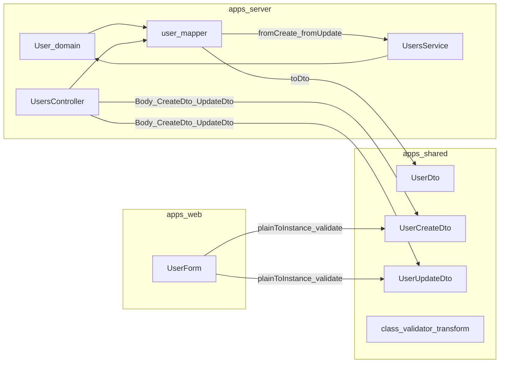
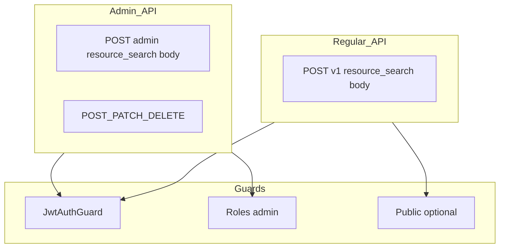

# Monorepo CRUD Pattern

Living architecture plan for Home AI: npm workspaces, `@home-ai/shared` model DTOs, server mappers, the [`apps/shared/CRUD_PATTERN.md`](../apps/shared/CRUD_PATTERN.md) playbook, admin vs regular APIs, and search conventions.

**Source:** This file mirrors the Cursor plan *Monorepo shared CRUD pattern*; edit here when the approach evolves, and sync major changes back into [`apps/shared/CRUD_PATTERN.md`](../apps/shared/CRUD_PATTERN.md) as the day-to-day developer checklist.

---

## Plan status

### Completed

- [x] Root `package.json` workspaces `apps/*`; `apps/shared` package; wire `@home-ai/shared` in server and web
- [x] User DTOs + `UserUtils`; server `user.mapper.ts`; `UsersController` + web `UserForm` without Zod

### Pending (playbook sync)

- [x] Align [`apps/shared/CRUD_PATTERN.md`](../apps/shared/CRUD_PATTERN.md) **§5** with [Search DTO shape (short term)](#search-dto-shape-short-term-one-optional-search-string) (`search` + flags + pagination; defer per-axis DTO fields until needed)
- [ ] Add **Admin vs Regular** section to `apps/shared/CRUD_PATTERN.md` (tables, search semantics, mutations, auth matrix, route prefix)
- [x] Document **shared `SearchRequestDto` / `SearchRequest`**, controller-level non-admin scope enforcement, pagination defaults, **POST-first** list/search, and [Naming conventions](#naming-conventions-dtos-search-bodies-controller-files) (see [GET vs POST for search](#get-vs-post-for-search))
- [x] **Implement** `POST …/search` (+ `{ items, total, pageNumber, pageSize }`) for **audit**, **AI audit**, and **app log** (admin read-only); retire legacy `GET` list routes for those resources
- [ ] **Implement** `POST …/search` across remaining entities; retire legacy `GET` list routes when callers are updated
- [ ] Extend per-entity checklist: admin CRUD + optional regular read controller + auth matrix row

### Per-entity completion checklist

Use this checklist for each entity rollout after the User baseline:

- [x] **User** - Golden baseline established (controller trust boundary + no service scope override + search pipeline).
- [x] **Device** - Search endpoint + service/store pipeline aligned; no legacy `GET` list route.
- [x] **Task** - Search endpoint + service/store pipeline aligned; no legacy `GET` list route.
- [x] **Fact** - Search endpoint + service/store pipeline aligned; no legacy `GET` list route.
- [x] **Recipe** - Search endpoint + service/store pipeline aligned; no legacy `GET` list route.
- [x] **Task request** - Search endpoint + service/store pipeline aligned; no legacy `GET` list route.
- [x] **App config** - Search endpoint + service/store pipeline aligned; no service-level scope coercion.
- [x] **Monitoring (AI audit / audit / log)** - Read-only admin search endpoints aligned.

For each checked entity:
- [x] Non-admin (when present) forces `includeInactive = false` in controller.
- [x] Admin controller does not hardcode non-admin restrictions.
- [x] Service does not override access scope.
- [x] Store owns SQL search/pagination semantics.
- [x] Search responses use envelope `{ items, total, pageNumber?, pageSize? }`.

---

## Goals

- **Root monorepo**: single [`package.json`](../package.json) with workspaces so `apps/server`, `apps/web`, and **`apps/shared`** link together.
- **Shared code**: [`apps/shared`](../apps/shared) — model under `src/model/<name>/` (not `entities`); optional `<Name>Utils` static helpers.
- **DTO rules**: **Create/Update DTOs must not** include server timestamps (`createdAt` / `updatedAt`). Read wire types carry ISO **strings** on the wire where applicable; mappers convert `Date` on the server. Use **`<Name>Dto`** for read surfaces, with optional **`<Name>CreateDto`** / **`<Name>UpdateDto`** for writes (see **Naming conventions** → **Wire / read DTO class names** below).
- **Transformers**: **Domain ↔ DTO** in server-only `*.mapper.ts` (shared stays free of Nest/domain types).
- **React**: `reflect-metadata` + `experimentalDecorators` + `useDefineForClassFields: false`; forms use the same DTO classes as Nest.

---

## Naming conventions (DTOs, search bodies, controller files)

### API version in URLs vs names

- HTTP routes may use **`/api/v1/...`** (and later `/api/v2/...` if ever needed). **Do not** put that version into **TypeScript class names**, **search DTO names**, or **controller filenames** (`UserV1SearchRequestDto`, `users-v1.controller.ts`, etc.). Version belongs at the **routing** layer only; DTOs describe the **domain contract** for that tier.

### Search and list DTOs (`@home-ai/shared`)

**Default (less duplication):** shared **`SearchRequestDto`** (`@home-ai/shared`, `src/search/search.dto.ts`) as **`@Body()`** for **`POST …/search`** on every resource until an entity needs extra validated fields (then add **`<Entity>SearchRequestDto`** or **`<Entity>AdminSearchDto`**). **Non-admin controllers must force `includeInactive = false`** so JWT callers cannot widen inactive rows; **admin** users/app-config may honor request `includeInactive`. **No second DTO** unless shapes diverge.

| Artifact | Pattern | Example |
|----------|---------|---------|
| **Search body** (default) | **`SearchRequestDto`** | `search`, `includeInactive`, `pageNumber`, `pageSize` |
| **Store/service input** | **`SearchRequest`** | extends **`PaginationRequest`**; optional **`XSearchRequest extends SearchRequest`** later |
| **Envelope** | **`SearchResponseDto<T>`** | e.g. **`SearchResponseDto<UserDto>`** or **`SearchResponseDto<AIAuditDto>`** — `items`, `total`, optional `pageNumber` / `pageSize` |

Legacy **`GET` list + query DTO** for users is **retired**; admin list uses **`POST …/search`** + **`SearchRequestDto`**.

### Search DTO shape (short term): one optional `search` string

To keep development fast, default on **`SearchRequestDto`** / **`SearchRequest`**:

- **`search?: string`** — optional free-text; **semantics are entity-specific** in each **store** (document in store JSDoc).
- **`includeInactive`** — **non-admin controllers** must force this to `false`; admin controllers may honor request value for the trust boundary ([Naming conventions](#naming-conventions-dtos-search-bodies-controller-files)).
- **Pagination** — **`pageNumber`**, **`pageSize`** on **`SearchRequest`**.

**Do not** add per-column DTO properties **until** needed; then extend **`SearchRequest`** (e.g. **`FactSearchRequest extends SearchRequest`**) and optionally add **`<Entity>SearchRequestDto`** with **`@ValidateNested()`** if the HTTP body grows.

**Per-entity** types are optional extensions of **`SearchRequest`** only when the HTTP contract gains fields beyond **`SearchRequestDto`**.

### Wire / read DTO class names (`@home-ai/shared`)

- **CRUD entities** (create + update bodies distinct from reads) — use **`<Name>Dto`** for GET/search row JSON and **`<Name>CreateDto`** / **`<Name>UpdateDto`** for writes. **`SearchResponseDto<<Name>Dto>`** for search lists.
- **Read-only projections** (append-only logs, admin-only audit rows, no HTTP create/update for that model) — prefer a **single wire class** named **`<Name>Dto`** (e.g. **`AIAuditDto`**) instead of **`Response`** in the type name: one shape, no redundant “response” suffix. Use **`SearchResponseDto<<Name>Dto>`** for search **`items`**. Server mapper: **`toDto`** or **`<name>ToDto`** (e.g. **`aiAuditToDto`**).

### Nest controller **files** (next to `<entity>.store.ts` in `apps/server`)

- Use **kebab-case** matching the entity folder: **`user` → `user.controller.ts`**, **`app-config` → `app-config.controller.ts`**.
- When the same entity has **both** admin routes and non-admin routes, prefer **split files**:
  - **`<entity>-admin.controller.ts`** — `@Controller('admin/...')`, `@Roles('admin')` where applicable;
  - **`<entity>.controller.ts`** — non-admin routes (e.g. `@Controller('v1/users')`).
- **Avoid** filenames like `users-v1.controller.ts`. Nest **class** names can stay readable (`UserAdminController`, `UserController`); keep **file** names entity-centric as above.

---

## Model surface properties (admin vs user)

Each domain model can expose **up to four** independent capabilities. They map to **two HTTP surfaces**: an **admin** controller (under `/api/admin/...`, `@Roles('admin')`) and optionally a **user** controller (under **`/api/v1/...`**, with `@Public()`, `@Roles(...)`, or JWT-only rules per route — see [Admin vs regular HTTP surface](#admin-vs-regular-http-surface)). **Convention:** no `app` segment in URLs; the non-admin tier is always **`v1`**.

**Two controllers per model (when needed)** — Prefer **`<Name>AdminController`** (or `admin/<name>` routes today) for admin-only behavior and a **non-admin** controller (`@Controller('v1/<resource>')`) for the JWT tier. Use the **same** **`SearchRequestDto`** on both **`POST …/search`** handlers unless the entity adds a dedicated search body. **Service and store:** one **`search(criteria)`** per entity accepting **`SearchRequest`**; **controllers** enforce scope — **non-admin** sets **`includeInactive = false`**, **admin** may honor request value. See [Single search pipeline](#single-search-pipeline-service-store) and [Naming conventions](#naming-conventions-dtos-search-bodies-controller-files).

**Multi-row reads (list / search)** — Prefer **`POST /api/admin/<resource>/search`** and **`POST /api/v1/<resource>/search`** with **`SearchRequestDto`** (`@Body()`). **Defaults:** empty **`{}`** follows each entity’s documented behavior (full active set vs first page for large append-only tables). **Single row by id** may stay **`GET .../:id`**; that is not bulk search.

**Working order:** implement **one entity at a time** (shared DTOs → store/service behavior → admin routes → optional `v1` routes per the matrix). That keeps auth, active-only rules, and query DTOs reviewable in small slices.

### Property definitions

| # | Property | Meaning |
|---|----------|---------|
| 1 | **Admin Searchable** | Admin has a **paginated search** HTTP endpoint (**`POST` + `SearchRequestDto`**, see below) whose contract allows viewing **all** relevant rows, including inactive rows where the table has an **`active`** flag. Callers narrow with optional **`search`** plus pagination. Append-only tables use the same shape with **default paging** where unbounded scans would be unsafe. |
| 2 | **Admin Editable** | Admin has **full CRUD** over the resource where the domain supports it: **Create**, **Update**, **Delete** (and soft toggles like `active` when applicable). If the product only supports a subset (e.g. update-only task definitions), treat as **Partial** in the matrix and note it. |
| 3 | **User Searchable** | Non-admin tier uses the **same** **`SearchRequestDto`** and the **same** search pipeline as admin. The **non-admin controller** must force **`includeInactive = false`** so only **active** rows are visible. Defaults (empty body) return the full **active** set where documented. |
| 4 | **User Editable** | User tier allows the same **full CRUD** the product grants to non-admin callers (create/update/delete). Often **No** for sensitive platform data; **Partial** when only create or only update is exposed (e.g. task requests filed by a user). |

### Entity matrix (Home AI — target / current intent)

Values: **Yes** | **No** | **Partial** (see Notes). Use **Notes** to call out whether a capability is already implemented vs still pending; the matrix is the **contract** to implement toward.

| Entity | Admin Searchable | Admin Editable | User Searchable | User Editable | Notes |
|--------|------------------|----------------|-----------------|---------------|-------|
| **User** | Yes | Yes | Yes | No | User tier: list **active** accounts for pickers / chat identity; lifecycle stays admin-only. |
| **App config** | Yes | Yes | No | No | User tier rarely exposes raw config; if needed later, limit to non-secret read-only keys. |
| **Device** | Yes | Yes | Yes | No | User tier: HA-linked devices **active** only; provisioning stays admin. |
| **Task** (registry) | Yes | Partial | Yes | No | Admin: **update** definitions in HTTP today, no admin **create** route. User target: read active task catalog for orchestration/UI. (Current: v1 controller pending.) |
| **Fact** | Yes | Yes | Yes | Partial | User target: search visibility-scoped facts; edits may be **owner-only** REST later (today much of this is tool-driven). (Current: v1 controller pending.) |
| **Recipe** | Yes | Yes | Yes | No | User target: browse **active** recipes; cookbook edits stay admin unless you add contributor flows. (Current: v1 controller pending.) |
| **Task request** | Yes | Partial | Yes | Partial | Admin: status (and similar) **PATCH**, no admin **create**. User target: see own pipeline; **create** may be product-specific (orchestrator vs REST). (Current: v1 controller pending.) |
| **AI audit** | Yes | No | No | No | Append-only; admin query only. |
| **Audit** (entity change log) | Yes | No | No | No | Same as AI audit. |
| **Log** (app log) | Yes | No | No | No | Same as AI audit. |

**Legend**

- **Partial** under **Admin Editable** / **User Editable**: not full create/update/delete over HTTP for that tier; the Notes column spells out what exists today or what to build first.
- **No** under **User Searchable** for logs/audits: intentional; those surfaces stay **admin-only** for privacy and volume.

When you add a new entity, extend this table and add the corresponding admin (and optional user) controllers plus shared **search body** and mutation DTOs per column.

---

## Architecture (data flow)

---

## `apps/shared` layout (per model)

| Path | Purpose |
|------|---------|
| [`apps/shared/package.json`](../apps/shared/package.json) | `@home-ai/shared`, build to `dist`, deps: `class-validator`, `class-transformer`, `reflect-metadata` |
| [`apps/shared/src/search/`](../apps/shared/src/search/) | **`SearchRequestDto`**, **`SearchResponseDto<T>`**, **`SearchUtils`** — default search body, response envelope, pagination helpers |
| [`apps/shared/src/model/<name>/`](../apps/shared/src/model/) | `<Name>Dto`, `<Name>CreateDto`, `<Name>UpdateDto`, optional `<Name>Utils` (optional entity-specific **request** DTO / extended **`SearchRequest`** only if shapes diverge) |
| [`apps/shared/src/index.ts`](../apps/shared/src/index.ts) | Barrel exports |

---

## Server

- **Mapper** next to entity: `toDto`/`<entity>ToDto`, `fromCreateDto`, `fromUpdateDto` as needed.
- **Controller**: `@Body()` shared DTOs for **search**, create, and update; global `ValidationPipe` with `transform: true`.
- **Service**: domain rules and store calls; avoid leaking transport DTOs deep into persistence if you can help it.

---

## Web

- Vite: alias `@home-ai/shared` → shared **source** for decorator bundling (see [`apps/web/vite.config.ts`](../apps/web/vite.config.ts)).
- Forms: submit typed DTO-shaped payloads; server-side `ValidationPipe` and `ValidationService` remain the validation source of truth.

---

## Standardized playbook

Canonical checklist for implementers: [`apps/shared/CRUD_PATTERN.md`](../apps/shared/CRUD_PATTERN.md).

Baseline:

1. **Shared**: `src/model/<name>/` — read + create + update DTOs; optional utils. Reuse **`SearchRequestDto`**, **`SearchResponseDto<<Name>Dto>`**, and **`SearchRequest`** ([Naming conventions](#naming-conventions-dtos-search-bodies-controller-files)).
2. **Server**: `<name>.mapper.ts`; one **`search(criteria: SearchRequestDto)`** (or extended type) per entity ([Single search pipeline](#single-search-pipeline-service-store)); **`POST …/search`** uses **`SearchRequestDto`** by default; non-admin forces `includeInactive = false`; **`GET :id`** optional for single-resource reads.
3. **Web**: send DTO-shaped payloads and surface server validation feedback.
4. **Optional**: split admin vs public response DTOs when shapes diverge.

### Read-only admin APIs (list + search)

Append-only / log-style admin surfaces (**AI audit**, **entity audit**, **app log**, and similar) have **no** create/update/delete over HTTP but **do** support **search** via the same **`POST .../search` + body DTO** convention: validated DTO in `@home-ai/shared`, optional **`search`** text interpreted per table in the store, pagination, service wiring, mapped `items` in the response envelope. Full detail and checklist: [`apps/shared/CRUD_PATTERN.md`](../apps/shared/CRUD_PATTERN.md) **§5**.

---

## Admin vs regular HTTP surface

### Intent

| Tier | Search | Mutations |
|------|--------|-----------|
| **Admin** | Search/list **including disabled** | **Create**, **Update**, **Delete** (where supported) |
| **Regular** | Search/list **enabled/active only** | **No** CUD (read-only product surface) |
| **Auth** | **Mixed** per resource; document each route (public vs JWT vs admin). |

### Conceptual split

- **Admin**: `/api/admin/...`, `@Roles('admin')`. Example: `POST /api/admin/users/search` with body `{ "includeInactive": true }` and optional `pageNumber` / `pageSize`.
- **Regular (user tier):** **`/api/v1/<resource>`** (global prefix `api` + controller path `v1/...`). Do not use `admin/*` for enabled-only lists.

### Fold into `CRUD_PATTERN.md`

1. Route naming: `admin/` vs **`v1/`**; `webhooks/` for integrations.
2. One **`SearchRequestDto`** for both tiers by default; **non-admin controllers** force `includeInactive = false` (see [Single search pipeline](#single-search-pipeline-service-store)).
3. CUD only on admin for this pattern.
4. Auth matrix template per resource.
5. Use **`SearchResponseDto<T>`** for list envelopes; split admin-only **request** DTOs only when the contract truly diverges.
6. Reuse mappers when response shapes match.

### Search: store vs service vs controller

| Layer | Responsibility |
|-------|----------------|
| **Store** | **One** `search(criteria)` (or equivalent name) per entity: Knex/SQL from a **single internal criteria** type (`includeInactive`, optional **`search`** text, pagination). No parallel `searchForAdmin` / `searchForUser` methods. |
| **Service** | **One** `search` method per entity that forwards to the store (orchestration, transactions). Do not override controller scope decisions in service-level includeInactive logic. |
| **Controller** | Validate **`@Body()`** with **`SearchRequestDto`**; non-admin forces **`includeInactive = false`**; admin users/app-config may honor request value. Then call **`search`**. **`GET :id`** unchanged where used. |

### Single search pipeline (service + store)

- **Goal:** avoid duplicate **`search*`** methods for “admin vs user” in services and stores, and **avoid duplicate search DTO classes** unless an entity truly needs a different admin contract.
- **Pattern:** **`SearchRequestDto`** in **`@home-ai/shared`** is the default **`search(criteria)`** input; extend only when needed (see [`apps/shared/CRUD_PATTERN.md`](../apps/shared/CRUD_PATTERN.md) §1 / §2). The **store** maps **`search`** to SQL per table. **`UsersService.search`**, **`UserStore.search`**, etc. accept search criteria from controller-validated DTOs; the server entity folder stays controller(s), mapper, service, store, domain.
- **Shared HTTP DTO:** **`SearchRequestDto`** validates **`POST …/search`** bodies by default.
- **Admin controller (users, app config):** may honor request `includeInactive`.
- **Non-admin controller:** force `includeInactive = false` — **`includeInactive` is never true** from the client; document in code.
- **Trade-off (intentional):** **`SearchRequestDto`** lists `includeInactive` in OpenAPI for v1; non-admin **enforces** inactive scope at the **controller boundary**, not by omitting the property.

### Store `search` methods and `AbstractEntityStore`

- **Per entity:** One **`search(...)`** on the store for that table, taking explicit search properties (`search`, `skip`, `take`, `includeInactive`) derived by the service from **`SearchRequestDto`**. **How `search` maps to columns** differs per table.
- **Not every store** gains `search` until that row in the matrix needs it.
- **Stores that do not extend** [`AbstractEntityStore`](../apps/server/src/core/entities/abstract-entity.store.ts) (e.g. app config, logs, audits) follow the same **single `search(criteria)`** idea for their own tables.
- **`AbstractEntityStore` updates remain optional:** add **`protected`** helpers when repetition appears (`applyIncludeInactive`, pagination helpers); do **not** require a generic `search` on the abstract class unless you adopt a typed template for all subclasses.

### GET vs POST for search

- **Default (multi-row reads):** **`POST`** + validated **`SearchRequestDto`** body (or entity-specific search DTO later). Route shape: **`POST /api/admin/<resource>/search`** and **`POST /api/v1/<resource>/search`**. Empty body → default list for that entity. Non-admin handlers force `includeInactive = false` before `search`.
- **Single row by id:** **`GET /api/admin/<resource>/:id`** and **`GET /api/v1/<resource>/:id`** remain acceptable (cacheable, simple); they are **not** a substitute for bulk search.
- **Exception — `GET` + query:** allowed only when a resource **must** be linkable/bookmarkable as a read-only filter set **and** the query stays small and non-sensitive; document the exception in the entity row and migrate to `POST` when filters grow.

---

## Opinion

- Server **mappers** keep `@home-ai/shared` usable from Vite without importing Nest domains.
- **ISO string dates** on response DTOs avoid JSON `Date` surprises.
- **Admin vs regular** + **search layering** make permission and “active only” rules easy to review.
